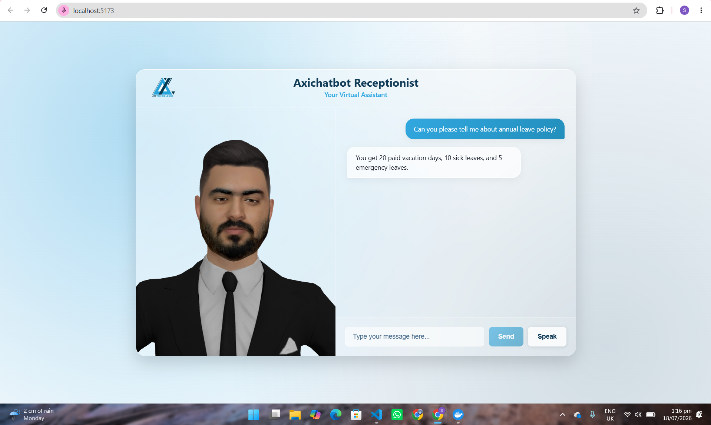

# Axichatbot — AI Video Reception Chatbot

An AI-powered video receptionist that greets visitors, answers questions about the company using real company data, and responds with a 3D avatar with lip-synced speech.

## Screenshots

### Avatar & Chat Interface


## Features
- Speech-to-speech conversation (speak to it, it speaks back)
- Grounded answers from real company documents (RAG)
- 3D avatar with real-time lip sync
- English support (Urdu/Roman Urdu coming in Phase 3)

## Tech Stack
- **Backend:** FastAPI
- **Frontend:** React + Vite + Three.js
- **LLM:** Qwen 3 via Groq API
- **Speech-to-Text:** Groq Whisper Large v3
- **Text-to-Speech:** Groq Orpheus TTS
- **Embeddings:** BGE-M3
- **Vector DB:** Qdrant (Docker)
- **Lip Sync:** Rhubarb Lip Sync
- **Avatar:** Avaturn GLB + Three.js morph target animation

## Setup

### Prerequisites
- Python 3.11+
- Node.js 18+
- Docker Desktop
- Rhubarb Lip Sync binary at `D:\rhubarb\rhubarb.exe`

### Backend
```bash
python -m venv venv
venv\Scripts\activate
pip install -r requirements.txt
```

Create a `.env` file:
GROQ_API_KEY=your_groq_api_key_here

Start Qdrant:
```bash
docker compose up -d
```

Ingest company documents:
```bash
python ingest.py
```

Start backend:
```bash
uvicorn main:app
```

### Frontend
```bash
cd axichatbot-frontend
npm install
npm run dev
```

Place your avatar GLB file at `axichatbot-frontend/public/avatar1.glb`.

## Notes
- The `sample_docs/` folder contains placeholder company information. Replace with your own markdown files before use.
- The avatar GLB file is not included in the repo (file size). Download a Type 2 avatar with animation from avaturn.me.
- Rhubarb Lip Sync binary is not included — download separately (see Setup above).