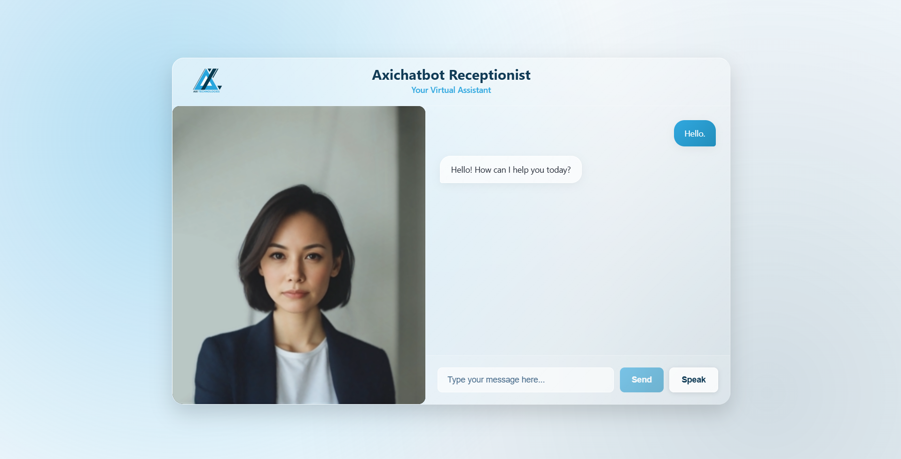

# Axichatbot — AI Video Reception Chatbot

An AI-powered video receptionist that greets visitors, answers questions about the company using real company data, and responds with a 3D avatar with lip-synced speech.

## Screenshots

### Avatar & Chat Interface


## Features
- Text-to-Text conversation
- Speech-to-speech conversation (speak to it, it speaks back)
- Grounded answers from real company documents (RAG)
- 3D avatar with real-time lip sync
- English support (Urdu/Roman Urdu coming in Phase 3)

## Tech Stack
- **Backend:** FastAPI
- **Frontend:** React + Vite + Three.js
- **LLM:** Qwen 3 via Groq API
- **Speech-to-Text:** Groq Whisper Large v3
- **Text-to-Speech:** Groq Orpheus TTS
- **Embeddings:** BGE-M3
- **Vector DB:** Qdrant (Docker)
- **Lip Sync & 3D Avatar:** Simli 


## Setup

### Prerequisites
- Python 3.11+
- Node.js 18+
- Docker Desktop
- Simli API key + face_id (signup at simli.com)

### Backend
```bash
python -m venv venv
venv\Scripts\activate
pip install -r requirements.txt
```

Create a `.env` file:
GROQ_API_KEY=your_groq_api_key_here

POSTGRES_HOST=localhost
POSTGRES_PORT=5432
POSTGRES_DB=axichatbot
POSTGRES_USER=your_postgres_user
POSTGRES_PASSWORD=your_postgres_password

SIMLI_API_KEY=your_simli_api_key_here
SIMLI_FACE_ID=your_simli_face_id_here

Start Qdrant:
```bash
docker compose up -d
```

Ingest company documents:
```bash
python ingest.py
```

Start backend:
```bash
uvicorn main:app or python -m uvicorn main:app
```

### Frontend
```bash
cd axichatbot-frontend
npm install
npm run dev
```

## Connect to the PostgreSQL Database
Run the following command to access the PostgreSQL database running in the Docker container:
```bash
docker exec -it axichatbot-postgres psql -U axiadmin -d axichatbot
```

## Notes
- The `sample_docs/` folder contains placeholder company information. Replace with your own markdown files before use.
- Avatar rendering and lip sync are handled entirely through the Simli API — no local GLB avatar file, Rhubarb binary, or morph-target animation setup is required.